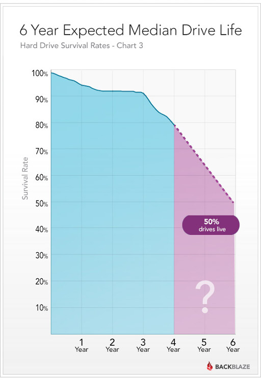

# Why worry about data?

## On the importance of data vs. publications

In 20 years, the data that we produce today could be far more valuable than the hypotheses *du jour* that we publish and test. 

- David Schimel, Research Scientist, NASA Jet Propulsion Laboratory & CalTech


## Case in point: Linnaeus


*All the species recognized by Botanists came forth from the Almighty Creator's hand, and the number of these is now and always will be exactly the same.*


## The Linnaen collection

18,000+ plants, fish, shells, and insects, some of which are extinct


# You've got data, and your current storage device might not work after 6 years. 

## 




## Where to store data? 

Best: 

- PetaLibrary (< 75 TB active or 100 TB archive)

Fair/poor: 

- Project spaces (< 250 GB): /projects/user1234

Not so good: 

- Lustre & general purpose scratch (data are regularly purged)

Bad:

- Your RC home directory (< 2 GB)


## Once the work is done


# How to transfer data?

## `scp`

Syntax:

```
scp <origin> <destination>
```


## `scp`

Local to remote:

```
scp ${local filename} 
    ${rc_user}@tutorial-login.rc.colorado.edu:
```


## `scp`

Local to remote, specifying path:

```
scp ${local filename} 
    ${rc_user}@tutorial-login.rc.colorado.edu:/projects/${rc_user}/
```


## `scp`

Remote to local

```
scp ${rc_user}@tutorial-login.rc.colorado.edu:*.txt  ~/Desktop/
```


## `rsync`

Sync entire directories

Access via remote shell:

- Pull: `rsync [OPTION...] [USER@]HOST:SRC... [DEST]`
- Push: `rsync [OPTION...] SRC... [USER@]HOST:DEST`


## Syncing a project directory

Remote to local

```
rsync -rv 
  user0020@tutorial-login.rc.colorado.edu: 
  ~/Desktop/remote_home/

```

`-rv` causes a recursive verbose sync


## Edit a file locally and sync remotely

```
rsync -rv 
  ~/Desktop/remote_home/
  user0020@tutorial-login.rc.colorado.edu: 
```


## More CLIs

Slides: [https://github.com/mbjoseph/data-transfer](https://github.com/mbjoseph/data-transfer)

`sftp`: interactive secure file transfer program

`git`: great for code, but not data


## But I want a graphical user interface now!


# Globus


## Getting started

1. Sign up for an account: [https://www.globus.org](https://www.globus.org)


## Logging in

- Use "University of Colorado at Boulder" as your affiliation

- log in with your identikey username and password


## Make your laptop an endpoint

1. Endpoints $\rightarrow$ add Globus Connect Personal endpoint

2. Name your laptop & copy the security key

3. Download and install local client (Globus Connect Personal)

4. Insert your security key when prompted


## Testing

1. Select "Transfer files"

2. Choose "CU Boulder 2016 HPC bootcamp" as one endpoint

3. Choose your laptop as the other endpoint

4. Transfer files


## Further resources

CU Data Management Planning: [https://data.colorado.edu/dmp](https://data.colorado.edu/dmp)

CU Research Data Services: [https://data.colorado.edu/](https://data.colorado.edu/)

PetaLibrary: [https://www.rc.colorado.edu/resources/storage/petalibrary](https://www.rc.colorado.edu/resources/storage/petalibrary)
