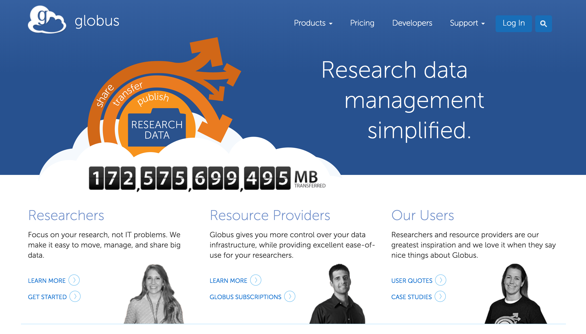

# Command line utilities

## `scp`

Syntax:

```
scp <origin> <destination>
```


## `scp`

Local to remote:

```
scp ${local filename} 
    ${rc_user}@login.rc.colorado.edu:
```


## `scp`

Local to remote, specifying path:

```
scp ${local filename} 
    ${rc_user}@login.rc.colorado.edu:/projects/${rc_user}/
```


## `scp`

Remote to local

```
scp ${rc_user}@login.rc.colorado.edu:*.txt  ~/Desktop/
```


## More CLIs

`sftp`: interactive secure file transfer program

`rsync`: synchronizing directories

`git`: great for code, but not data


## But I want a graphical user interface now!


# Globus


## Getting started

1. Sign up for an account: [https://www.globus.org](https://www.globus.org)




## Logging in

- Use "University of Colorado at Boulder" as your affiliation

- log in with your identikey username and password


